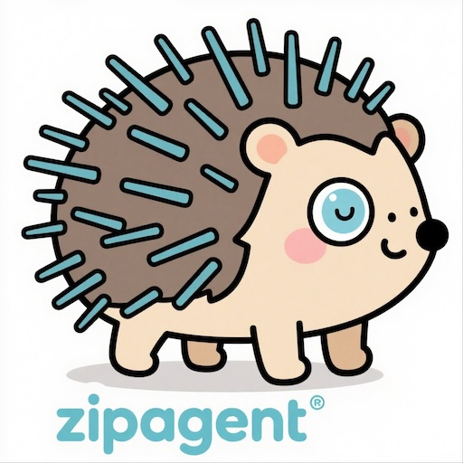

<div align="center">

⭐ **If this project helps you, please give us a Star!** ⭐

<p align="center">
  
  &nbsp;&nbsp;&nbsp;&nbsp;
  
</p>

[](https://badge.fury.io/py/zipagent)
[](https://pepy.tech/project/zipagent)
[](https://pypi.org/project/zipagent/)
[](https://opensource.org/licenses/MIT)

[📚 Documentation](https://jiayuxu0.github.io/zipagent) | [🚀 Quick Start](#-quick-start) | [💬 Discussions](https://github.com/JiayuXu0/ZipAgent/discussions) | [🐛 Issues](https://github.com/JiayuXu0/ZipAgent/issues) | [🇨🇳 中文](README.md)

</div>

ZipAgent is a modern Python AI Agent framework focused on simplicity, efficiency, and extensibility. **Built with just 700 lines of core code to implement a complete intelligent agent framework with Agent engine, tool system, and conversation management, enabling you to quickly build your own AI assistant.**

## 🎯 Use Cases

<table>
<tr>
<td align="center">
  
  <br/><b>Customer Service</b><br/>
  <small>Auto-answer FAQs<br/>Handle order inquiries</small>
</td>
<td align="center">
  
  <br/><b>Code Assistant</b><br/>
  <small>Code review & generation<br/>Bug fix suggestions</small>
</td>
<td align="center">
  
  <br/><b>Data Analysis</b><br/>
  <small>Auto-generate reports<br/>Discover insights</small>
</td>
</tr>
<tr>
<td align="center">
  
  <br/><b>Content Generation</b><br/>
  <small>Writing assistant<br/>Marketing content</small>
</td>
<td align="center">
  
  <br/><b>Workflow Automation</b><br/>
  <small>Task scheduling<br/>Process automation</small>
</td>
<td align="center">
  
  <br/><b>Knowledge Q&A</b><br/>
  <small>Enterprise knowledge base<br/>Smart Q&A system</small>
</td>
</tr>
</table>

## ✨ Core Features

- **🎯 Simple API**: Minimal design, build AI Agents with just a few lines of code
- **🔧 Tool System**: Powerful `@function_tool` decorator for easy AI capability extension
- **🌊 Streaming Output**: Complete streaming support for real-time interactive experience
- **📝 Context Management**: Automatic conversation history and context state management
- **🔗 MCP Integration**: Native support for Model Context Protocol, integrate external tools
- **⚡ Modern**: Based on Python 3.10+, supports async programming
- **🧪 High Quality**: 105+ test cases, 75% code coverage

## 🚀 Quick Start

### Installation

```bash
pip install zipagent
```

### 5-Minute Tutorial

```python
from zipagent import Agent, Runner, function_tool

# 1. Define tools
@function_tool
def calculate(expression: str) -> str:
    """Calculate mathematical expressions"""
    return str(eval(expression))

# 2. Create Agent
agent = Agent(
    name="MathAssistant",
    instructions="You are a helpful math assistant",
    tools=[calculate]
)

# 3. Start conversation
result = Runner.run(agent, "Calculate 23 + 45")
print(result.content)  # "The result of 23 + 45 is 68"
```

## 📚 Feature Showcase

### 🌊 Streaming Output

```python
from zipagent import StreamEventType

# Real-time streaming response
for event in Runner.run_stream(agent, "Explain artificial intelligence"):
    if event.type == StreamEventType.ANSWER_DELTA:
        print(event.content, end="", flush=True)  # Typewriter effect
    elif event.type == StreamEventType.TOOL_CALL:
        print(f"🔧 Tool called: {event.tool_name}")
```

### 📝 Context Management

```python
from zipagent import Context

# Multi-turn conversation
context = Context()

result1 = Runner.run(agent, "My name is John", context=context)
result2 = Runner.run(agent, "What's my name?", context=context)
print(result2.content)  # "Your name is John"

# Conversation statistics
print(f"Turn count: {context.turn_count}")
print(f"Token usage: {context.usage}")
```

### 🔗 MCP Tool Integration

```python
from zipagent import MCPTool

# Connect external MCP tools
async def demo():
    # Connect to weather service
    weather_tools = await MCPTool.connect(
        command="npx",
        args=["-y", "@weather/weather-mcp-server"],
        env={"WEATHER_API_KEY": "your_key"}
    )
    
    # Mix local tools with MCP tools
    agent = Agent(
        name="WeatherAssistant",
        instructions="You are a weather assistant",
        tools=[calculate, weather_tools]  # Unified interface!
    )
    
    result = Runner.run(agent, "What's the weather in Tokyo today?")
    print(result.content)
```

## 🔧 Advanced Features

### Exception Handling

```python
from zipagent import ToolExecutionError, MaxTurnsError

try:
    result = Runner.run(agent, "Calculate 10 / 0", max_turns=3)
except ToolExecutionError as e:
    print(f"Tool execution failed: {e.details['tool_name']}")
except MaxTurnsError as e:
    print(f"Max turns reached: {e.details['max_turns']}")
```

### Custom Models

```python
from zipagent import OpenAIModel

# Custom model configuration
model = OpenAIModel(
    model="gpt-4",
    api_key="your_api_key",
    base_url="https://api.openai.com/v1"
)

agent = Agent(
    name="CustomAgent",
    instructions="You are an assistant",
    tools=[calculate],
    model=model
)
```

## 🏗️ Project Architecture

```
ZipAgent/
├── src/zipagent/           # Core framework
│   ├── agent.py            # Agent core class
│   ├── context.py          # Context management
│   ├── model.py            # LLM model abstraction
│   ├── runner.py           # Execution engine
│   ├── tool.py             # Tool system
│   ├── stream.py           # Streaming processing
│   ├── mcp_tool.py         # MCP tool integration
│   └── exceptions.py       # Exception system
├── examples/               # Usage examples
├── tests/                  # Test suite (105+ tests)
└── docs/                   # Documentation
```

## 📦 Dependencies

**Core Dependencies**:
- `openai` - OpenAI API client
- `pydantic` - Data validation

**Optional Dependencies**:
- `mcp` - MCP tool support
- `nest-asyncio` - Nested async support
- `python-dotenv` - Environment variable management

## 🛠️ Development

### Local Development Environment

```bash
# Clone project
git clone https://github.com/JiayuXu0/ZipAgent.git
cd ZipAgent

# Use uv for dependency management (recommended)
curl -LsSf https://astral.sh/uv/install.sh | sh
uv sync

# Run tests
uv run pytest

# Code checks
uv run ruff check --fix
uv run pyright
```

### Contributing

We welcome all forms of contributions!

1. 🐛 **Report Bugs**: Submit [Issues](https://github.com/JiayuXu0/ZipAgent/issues)
2. 💡 **Feature Suggestions**: Discuss new feature ideas
3. 📝 **Documentation**: Improve docs and examples
4. 🔧 **Code Contributions**: Submit Pull Requests

### Development Standards

- Use `ruff` for code formatting and checking
- Use `pyright` for type checking
- Write test cases, maintain high coverage
- Follow semantic versioning

## 📊 Performance

- ⚡ **Startup Speed**: Millisecond-level initialization
- 🔄 **Concurrency**: Support async concurrent processing
- 💾 **Memory Usage**: Lightweight design, low memory footprint
- 📦 **Package Size**: Wheel package only ~15KB

## 🗺️ Roadmap

- [ ] **Multi-model Support**: Claude, Gemini, local models
- [ ] **Plugin System**: Richer extension mechanisms
- [ ] **Visualization Interface**: Web UI and monitoring dashboard
- [ ] **Distributed Support**: Multi-instance collaboration
- [ ] **Performance Optimization**: Caching and batch processing

## 📄 License

MIT License - see [LICENSE](LICENSE) file for details

## 🤝 Acknowledgments

Thanks to all contributors and community support!

- OpenAI - Providing powerful LLM APIs
- MCP Community - Model Context Protocol standard
- Python Ecosystem - Excellent development toolchain

---

<div align="center">
  <a href="https://github.com/JiayuXu0/ZipAgent">
    
  </a>
</div>
